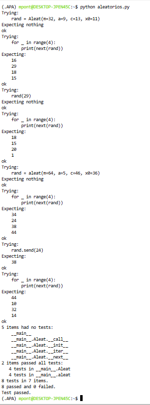

# Cuarta tarea de APA 2026: Generación de números aleatorios

## Alumno

Nom i cognoms: Pau Pont Camp

---

## Descripción

En esta tarea se implementa un generador de números pseudoaleatorios utilizando el algoritmo de Generación Lineal Congruente (LGC).

La implementación se realiza mediante:

- Una clase iterable llamada `Aleat`
- Una función generadora llamada `aleat()`

Ambas implementaciones permiten:

- Configurar el módulo (`m`)
- Configurar el multiplicador (`a`)
- Configurar el incremento (`c`)
- Configurar la semilla inicial (`x0`)
- Reiniciar la secuencia pseudoaleatoria

---

## Ficheros entregados

### `aleatorios.py`

Contiene:

- La clase iterable `Aleat`
- La función generadora `aleat()`
- Las cadenas de documentación
- Los tests unitarios mediante `doctest`

### `README.md`

Documento descriptivo de la práctica.

### `doctest_output.png`

Captura de pantalla mostrando la ejecución correcta de los tests unitarios.

---

## Ejecución de los tests unitarios

Para ejecutar los tests unitarios:

```bash
python aleatorios.py
```

O también:

```bash
python -m doctest -v aleatorios.py
```

---

## Captura de pantalla de los tests



---

## Código desarrollado

```python
"""Cuarta tarea de APA 2023: Generación de números aleatorios.

Alumno: Fulano Mengano Zutano

Este módulo implementa un generador lineal congruente de números
pseudoaleatorios mediante una clase iterable, Aleat, y una función
generadora, aleat.
"""


class Aleat:
    """Generador lineal congruente iterable."""

    def __init__(
        self,
        *,
        m=2**48,
        a=25214903917,
        c=11,
        x0=1212121,
    ):
        self.m = m
        self.a = a
        self.c = c
        self.x = x0

    def __iter__(self):
        return self

    def __next__(self):
        self.x = (self.a * self.x + self.c) % self.m
        return self.x

    def __call__(self, x0):
        self.x = x0


def aleat(*, m=2**48, a=25214903917, c=11, x0=1212121):

    x = x0

    while True:
        x = (a * x + c) % m
        nueva_semilla = yield x

        if nueva_semilla is not None:
            x = nueva_semilla


if __name__ == "__main__":
    import doctest

    doctest.testmod(verbose=True)
```

---

## Repositorio GitHub

La entrega se realiza mediante pull request al repositorio correspondiente de GitHub.
